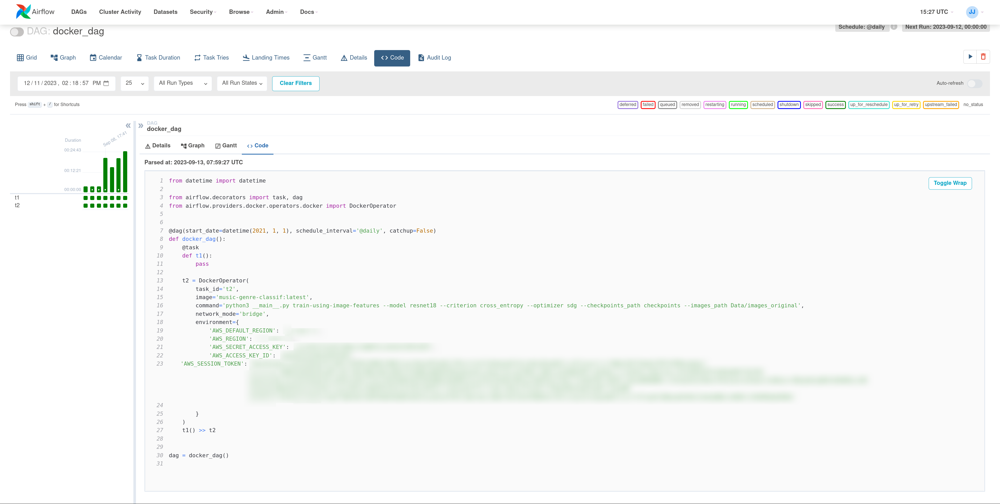

# Airflow

### What

Apache Airflow is a robust open-source orchestration tool designed to efficiently manage the complexities of machine
learning (ML) workflows. It serves as a comprehensive platform for defining, scheduling, and executing workflows,
providing a high degree of flexibility to customize and scale intricate data pipelines. Airflow's strengths lie in its
adeptness at handling dependencies, monitoring workflow progress, and supporting dynamic scheduling. This versatility
makes it an optimal choice for orchestrating ML pipelines, particularly in scenarios like music genre classification
workflows.

### Why

The advantages of Apache Airflow stem from its ability to streamline the orchestration of various tasks within ML
workflows. With a clear focus on managing dependencies and providing transparency in workflow progress, Airflow emerges
as an ideal tool for orchestrating ML pipelines. Its capacity to visualize task relationships and execution orders
through Directed Acyclic Graphs (DAGs) enhances the design and monitoring of data pipelines. Whether for batch
pipelines, end-to-end ML processes, ETL/ELT data integration, automated report generation, or DevOps tasks, Airflow
proves to be versatile and compatible with major data platforms. Its architecture, centered around DAGs and Python
scripting, facilitates accessibility and customization, aligning with the "workflow as code" philosophy.

### How

**Python Operator Approach:**
In the initial implementation, the Python Operator Approach is employed, utilizing Python operators within Apache
Airflow to execute CLI commands for pipeline execution. This approach, while providing flexibility, demands meticulous
management of package dependencies and data from Data Version Control (DVC). Leveraging the Click Python package, a
minimalist CLI creation tool, Click commands are employed to encapsulate functionality into CLI commands within the
Airflow pipeline. This strategy enhances readability and maintainability, encapsulating script logic within modular
commands triggered using the Python Operator. The integration with DVC ensures proper management of package dependencies
and data, enabling versioning and sharing of datasets for reproducibility in ML workflows. Click commands within the
Python Operator interact seamlessly with DVC commands, streamlining data coordination and enhancing the robustness and
traceability of the ML pipeline.

Usage example:

~~~python
from datetime import datetime

from airflow.decorators import task, dag
from airflow.providers.docker.operators.docker import DockerOperator

@dag(start_date=datetime(2021, 1, 1), schedule_interval='@daily', catchup=False)
def docker_dag():
    @task
    def t1():
        pass

    t2 = DockerOperator(
        task_id='t2',
        image='music-genre-classif:latest',
        command='python3 __main__.py train-using-image-features --model resnet18 --criterion cross_entropy --optimizer sdg --checkpoints_path checkpoints --images_path Data/images_original',
        network_mode='bridge',
        environment={
            'AWS_DEFAULT_REGION': 'us-east-1',
            'AWS_REGION': 'us-east-1',
            'AWS_SECRET_ACCESS_KEY': 'add_the_AWS_SECRET_ACCESS_KEY',
            'AWS_ACCESS_KEY_ID': 'add_the_AWS_ACCESS_KEY_ID',
            'AWS_SESSION_TOKEN': 'add_the_AWS_SESSION_TOKEN'

        }
    )
    t1() >> t2

dag = docker_dag()   
~~~

**Docker Operator Approach:**
In an alternative implementation, the Docker Operator Approach is adopted, utilizing the Docker operator for workflow
execution and pre-built Docker images for CLI command execution. This approach simplifies dependency and data management
during the image-building process. Despite the challenge of diverse hardware requirements when executing on a machine
running Docker, this approach offers notable benefits. The implementation constructs a Docker image based on a
multi-stage Dockerfile, optimizing the image for efficient dependency management, reduced size, enhanced security, and
environment isolation. The multi-stage Dockerfile's initial stage, based on the python3.8 image, installs essential
dependencies, while subsequent stages focus on specific tasks such as AWS CLI dependencies, DVC, and project
requirements. The resulting Docker image is optimized, ensuring faster deployment, reduced storage requirements, and
improved security. This image is then employed in the Dockerized approach within Apache Airflow. AWS credentials are
securely passed through environmental variables, facilitating the execution of a daily scheduled training command. This
strategic decision ensures the continual evaluation of the ML model's performance, supporting iterative model
improvement and aligning with project-specific requirements and business objectives.

The daily execution of the training task is strategically chosen for testing purposes, maintaining a dynamic and
adaptive ML model. This frequent cadence enables continuous monitoring, real-time evaluation, and timely detection of
anomalies. While beneficial for many scenarios, the implementation recognizes that in some real-world applications, the
frequency of model training may vary. Depending on project dynamics and requirements, the execution frequency can be
tailored to capture longer-term trends, accommodate periodic data updates, or address computational resource
constraints. Striking this balance ensures judicious resource use while meeting the specific goals and operational
demands of the ML workflow.

Furthermore, the implementation allows the execution of multiple commands within the same deliverable. For instance, a
code snippet demonstrates the addition of the trained model to DVC and its subsequent versioning through Git. This
approach facilitates ongoing monitoring of model versioning, ensuring robust tracking of the trained model's evolution
over time.

Usage example:

~~~python
from datetime import datetime

from airflow.decorators import task, dag
from airflow.providers.docker.operators.docker import DockerOperator

@dag(start_date=datetime(2021, 1, 1), schedule_interval='@daily', catchup=False)
def docker_dag():
    @task
    def t1():
        pass

    t2 = DockerOperator(
        task_id='t2',
        image='music-genre-classif:latest',
        command='python3 __main__.py train-using-image-features --model resnet18 --criterion cross_entropy --optimizer sdg --checkpoints_path checkpoints --images_path Data/images_original',
        network_mode='bridge',
        environment={
            'AWS_DEFAULT_REGION': 'us-east-1',
            'AWS_REGION': 'us-east-1',
            'AWS_SECRET_ACCESS_KEY': 'add_the_AWS_SECRET_ACCESS_KEY',
            'AWS_ACCESS_KEY_ID': 'add_the_AWS_ACCESS_KEY_ID',
            'AWS_SESSION_TOKEN': 'add_the_AWS_SESSION_TOKEN'

        }
    )
    t1() >> t2

dag = docker_dag()   
~~~

### Airflow UI

### Run Airflow UI

~~~bash
cd airflow
airflow scheduler
airflow webserver
~~~
