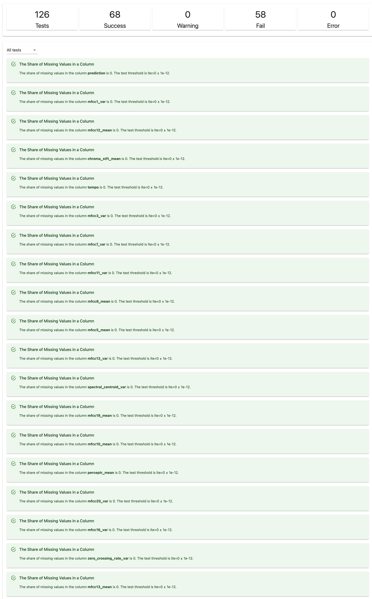

# Evidently AI

### What

Evidently is a versatile Python library designed for monitoring and analyzing machine learning models' performance in
production. It offers pre-built reports and test suites that enable users to assess model quality, detect issues like
data drift, and make informed decisions about model retraining or improvement.

### Why

Its utility lies in providing actionable insights into the behavior and effectiveness of machine learning models
deployed in real-world scenarios. By generating visual reports and conducting automated tests, Evidently empowers data
scientists and machine learning practitioners to continuously monitor model performance, identify potential issues, and
maintain model robustness over time, thereby enhancing the reliability and trustworthiness of AI-driven systems.
MLflow stands out as a robust and versatile solution in the realm of experiment management and model lifecycle tools. As
an open-source platform, MLflow distinguishes itself with transparency and extensive customization capabilities,
offering a framework that accommodates diverse machine-learning workflows. Its language-agnostic and framework-agnostic
design ensures flexibility and seamless integration with popular frameworks, making it a versatile choice for various ML
projects.

### How

Evidently AI offers robust tools for evaluating and monitoring classification models, ideal for music genre
classification tasks. Its pre-built Reports and Test Suites enable comprehensive analysis, whether in binary or
multi-class scenarios. Users can continuously monitor model performance in real-world production, scheduling regular
test suite runs to compare against predefined expectations and using visual reports for stakeholder communication. The
test suite facilitates proactive model retraining by detecting declines in quality, ensuring model accuracy over time.
Visual reports help identify areas for improvement, analyzing error-prone segments and refining model performance
iteratively. Evidently AI simplifies result analysis across different stages, from training to A/B testing and
deployment.
To implement Evidently AI for music genre classification, begin by ensuring you have already established the training
pipeline for your classification model. Once this is in place, integrate Evidently AI into your project by installing
the library using pip install evidently. Import the necessary modules and functions from Evidently to access its
reporting and testing functionalities within your Python script. Utilize Evidently AI's pre-built Classification
Performance Report to assess your model's quality by providing the test set containing ground truth and predicted genre
labels. Additionally, set up test suites within your pipeline to automate performance monitoring. Schedule regular runs
of these test suites to evaluate accuracy and identify potential issues like performance drift. Finally, interpret the
results of the generated reports and test suite outputs, analyzing key metrics such as accuracy, precision, recall,
F1-score, and confusion matrices. Use these insights to make informed decisions regarding model retraining, performance
improvement, and result analysis.

#### Classification Report

To produce a classification report tailored for music genre classification using Evidently, it is imperative to curate
the model logs into a structured pandas DataFrame. Each entry within the DataFrame should encapsulate pertinent details,
including the input features, predicted labels (or probabilities), and ground truth labels. Once this data preparation
step is completed, one can seamlessly employ Evidently's ClassificationPreset to conduct a rigorous analysis of the
classification model's efficacy.

The ensuing classification report, facilitated by Evidently, comprises a multifaceted array of components meticulously
designed to furnish insights into the model's quality and performance in the context of music genre classification.
Commencing with the Model Quality Summary Metrics, the report undertakes the computation of quintessential metrics such
as Accuracy, Precision, Recall, F1-score, ROC AUC, and LogLoss. These metrics serve as pillars in discerning the overall
performance of the classification model across diverse music genres. Furthermore, Evidently's provision of interactive
visualizations endeavors to pinpoint areas of model fallibility, thereby fostering opportunities for refinement.
Subsequently, the report unfolds to unveil Class Representation, offering a panoramic view of the distribution of
musical compositions across various genres. Complementing this, the Confusion Matrix encapsulates the nuances of
classification errors, elucidating their typology. Ultimately, Quality Metrics by Class empowers a granular examination
of model performance, affording insights into its proficiency in discerning individual music genres. Through the
amalgamation of these components, stakeholders can meticulously scrutinize the efficacy of the music genre
classification model, thereby fostering informed decision-making and continuous improvement endeavors.
Use case:

~~~python
from evidently.metric_preset import ClassificationPreset
from evidently.report import Report

classification_performance_report = Report(metrics=[
    ClassificationPreset(),
])

classification_performance_report.run(reference_data=bcancer_ref, current_data=bcancer_cur)

classification_performance_report
~~~

#### Classification Report for Music Genre Classification

#### Data Drift Report

To analyze data drift in the context of music genre classification, Evidently offers a robust solution encapsulated
within its Data Drift report. This tool is indispensable for detecting and exploring changes in the input data,
providing critical insights into the evolving nature of the dataset over time. Leveraging suitable drift detection
methods tailored for numerical, categorical, or text features, the Data Drift report furnishes a comprehensive overview
of feature values and distributions across two datasets.

At its core, the Data Drift report operates on the premise of comparative analysis between a reference dataset and the
current production data. By scrutinizing the input features' distributions, it discerns subtle variations indicative of
data drift. Essential to this process is ensuring the datasets' schema alignment, with identical features and a
consistent column mapping strategy. Through interactive visualizations, stakeholders can glean insights into the extent
of data drift, represented in the Data Drift Summary, which encapsulates the share of drifting features and an aggregate
Dataset Drift result. Furthermore, the Data Drift Table offers a detailed breakdown of drifting features, facilitating a
granular examination of their characteristics and typology. Complemented by Data Distribution by Feature and Data Drift
by Feature visualizations, stakeholders gain deeper insights into the evolving dataset's nuances, empowering proactive
measures to mitigate the impacts of data drift on the music genre classification model's performance.

~~~python
from evidently.metric_preset import DataDriftPreset
from evidently.report import Report

data_drift_report = Report(metrics=[
    DataDriftPreset(),
])

data_drift_report.run(reference_data=ref, current_data=cur)
data_drift_report
~~~

#### Data Drift Report for Music Genre Classification

#### Data Quality Tests

In the domain of music genre classification, maintaining data integrity is crucial, and Evidently's Data Quality report
stands as a vital instrument for this task. Seamlessly integrated into the pipeline, this report enables thorough
evaluations of data batches, even without a reference dataset, using the DataQualityTestPreset within a Test Suite. It
furnishes users with comprehensive insights into descriptive statistics, uncovering crucial aspects such as missing
data, duplicates, and features with minimal variation. The report's automated test condition generation, informed by
predefined heuristics or provided reference datasets, ensures efficient identification and resolution of potential
issues. Additionally, users can customize the assessment process by employing bespoke conditions, thereby optimizing
data quality checks to align with project-specific requirements. Ultimately, the Data Quality report serves as a
proactive safeguard, fortifying data integrity and fostering confidence in the music genre classification pipeline's
performance.

~~~python
from evidently.test_preset import DataQualityTestPreset
from evidently.test_suite import TestSuite

data_quality_test_suite = TestSuite(tests=[
    DataQualityTestPreset(),
])

data_quality_test_suite.run(reference_data=ref, current_data=curr)
data_quality_test_suite
~~~

#### Data Quality Test for Music Genre Classification

#### Data Stability Tests

To ensure the stability of data used in the music genre classification pipeline, integrating Evidently's Data Stability
Test Suite proves invaluable. By incorporating the DataStabilityTestPreset within a dedicated Test Suite, users can
effectively assess the consistency of newly acquired data batches compared to previous ones. This preset facilitates the
calculation of diverse dataset and feature statistics, enabling the detection of anomalies such as new categorical
values, out-of-range values, or fluctuations in data volume. Leveraging a reference dataset, Evidently automatically
generates test conditions, streamlining the evaluation process. Additionally, users have the flexibility to define
custom conditions, tailoring stability checks to specific project needs. Ultimately, the Data Stability Test Suite acts
as a proactive mechanism, ensuring the reliability and continuity of data inputs within the music genre classification
pipeline.

~~~python
from evidently.test_preset import DataStabilityTestPreset
from evidently.test_suite import TestSuite

# Data stability Report
data_stability = TestSuite(tests=[
    DataStabilityTestPreset(),
])
data_stability.run(reference_data=prv, current_data=curr)

data_stability
~~~

#### Data Stability Test for Music Genre Classification

