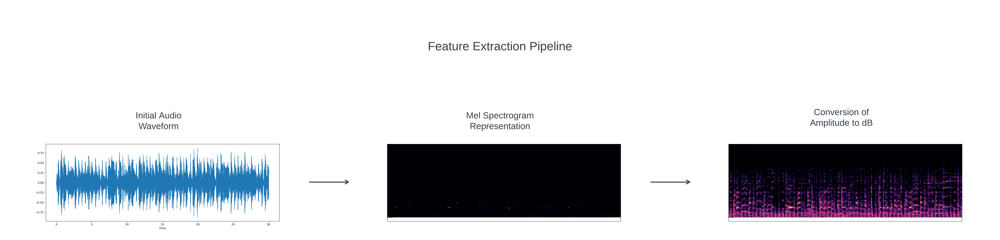

# Feature Extraction

## What

Feature extraction is a crucial stage in deep learning-based audio categorization. It involves the transformation of raw
audio data into meaningful representations that machine learning models can efficiently utilize. This process is
essential for enhancing the precision and effectiveness of music genre classification systems, as it allows the
identification of distinctive patterns and traits in audio data.

## Why

Feature extraction is vital for the following reasons:

* Enhancing Data Representation: It converts raw audio waveforms into representations that capture essential
  characteristics of the audio, making it easier for machine learning models to understand and learn from the data.
* Pattern Recognition: Extracted features enable the identification of distinctive patterns, spectral content, and other
  significant audio traits, which are critical for accurate audio classification.
* Reducing Dimensionality: Feature extraction can reduce the dimensionality of the data, making it computationally more
  manageable while retaining important information.

## How

In this study, feature extraction is implemented through a series of steps using the FeatureExtraction class:

### Mel Spectrogram Representation

The Mel spectrogram is used as a key representation for feature extraction. It is influenced by the non-linear frequency
perception of the human auditory system and depicts the spectrum of frequencies contained in an audio stream over time.
The following steps explain how it's generated:

#### Conversion to Mel Spectrogram

The input audio segment is first converted into a Mel spectrogram using the librosa.feature.melspectrogram function.
During this process, the audio waveform is divided into short time frames, and the energy of different frequency
components is mapped onto a Mel scale. This conversion enables the extraction of crucial spectral information required
for audio classification tasks.

#### Transformation to Frequency Domain

This conversion effectively transforms the audio signal from the time domain to the frequency domain, allowing the model
to analyze audio based on its frequency content.

### Conversion of Amplitude to dB

To enhance the interpretability and discriminative power of the Mel spectrogram, amplitude-to-decibel (dB) conversion is
applied. This conversion adjusts the amplitude values of the Mel spectrogram to a logarithmic dB scale, making lower
amplitude components more visible. It is facilitated by the librosa.amplitude_to_db function. This transformation
provides a perceptually accurate representation consistent with human auditory perception.

### Segmentation for Computational Efficiency

The segmentation of audio data is another crucial aspect of the feature extraction process. It is employed due to the
computational challenges posed by processing extensive audio recordings. This segmentation involves dividing the audio
into smaller chunks, enabling sequential processing and efficient memory utilization. This approach accommodates the
fixed-size input requirements of deep learning models and optimizes computational resources by segmenting the audio into
manageable portions.

### Feature Extraction Transformation

