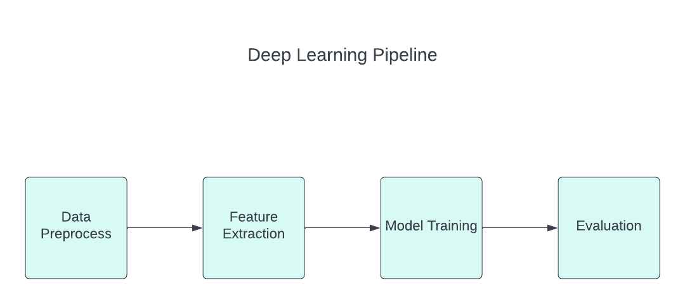

# Music Genre Classification Overview

## What

Music genre classification is a pivotal aspect of the music industry that involves categorizing songs or compositions
into specific genres based on their sonic characteristics, structure, and style.
This process serves several essential functions:

* Emotions: Music has a profound emotional impact on listeners. Genre classification helps people find music that
  matches their current emotional state or desired mood. For instance, someone seeking relaxation might look for
  classical music, while someone wanting to feel energized might opt for rock or hip-hop.
* Entertainment: Music streaming platforms and radio stations rely on genre classification to create playlists and
  recommendations tailored to users' preferences. This enhances the overall entertainment experience by offering a
  curated selection of music that aligns with individual tastes.
* Social Interaction: Music is a social phenomenon, and genre classification facilitates social interaction by enabling
  people to share and discuss their favorite songs and artists with others who appreciate the same genre. It fosters
  connections among music enthusiasts.
* Artistic Exploration: Musicians and composers use genre classification as a creative tool to explore different musical
  styles and experiment with genre fusion. It provides a framework for artists to innovate and push boundaries within
  established genres.

## Why

The importance of music genre classification is underscored by the changing landscape of the music industry:

* Discovery and Recommendation: In the digital age, where vast libraries of music are available at one's fingertips,
  genre classification is crucial for effective music discovery and recommendation systems. It helps users navigate
  through an overwhelming amount of content and discover new music aligned with their preferences.
* Market Segmentation: For music producers, distributors, and marketers, genre classification aids in market
  segmentation. It allows them to target specific audiences more effectively, tailoring promotional strategies and
  content to match the tastes of particular genre enthusiasts.
* Content Organization: Music streaming services and libraries use genre classification to organize their catalogs,
  making it easier for users to find and explore music. This structured approach enhances user engagement and
  satisfaction.
* Historical Context: Understanding the evolution of musical genres over time is vital for preserving cultural and
  historical aspects of music. Genre classification helps researchers and historians trace the development of music and
  its societal impact.

## How

Solving the music genre classification problem required the implementation of a pipeline to prepare the data, extract
features, training the model and evaluate.

* Audio preprocess:
    * convert audio to wav
    * audio streaming
* Feature extraction:
    * representation of the Mel Spectrogram
    * Conversion of Amplitude to dB
    * Segmentation for Computational Efficiency
* Model training:
    * Dataset creation
    * Model Initialization
    * Fine-tuning and Feature Learning
    * Loss Computation and Optimization
    * Validation and Performance Monitoring
* Model evaluation :
    * Precision
    * Recall
    * F1

### Deep Learning Pipeline

