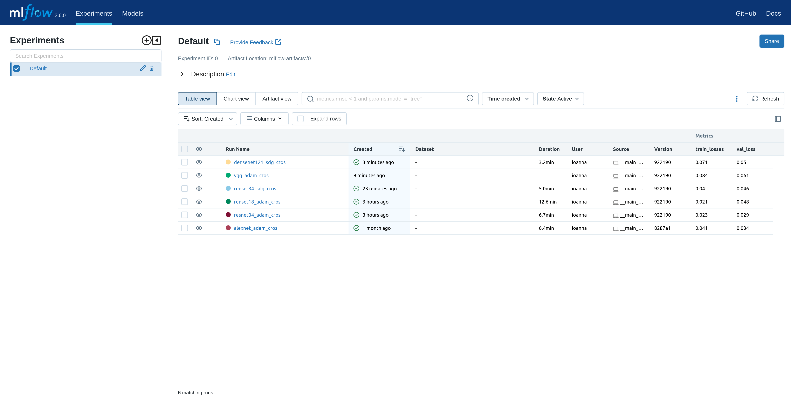
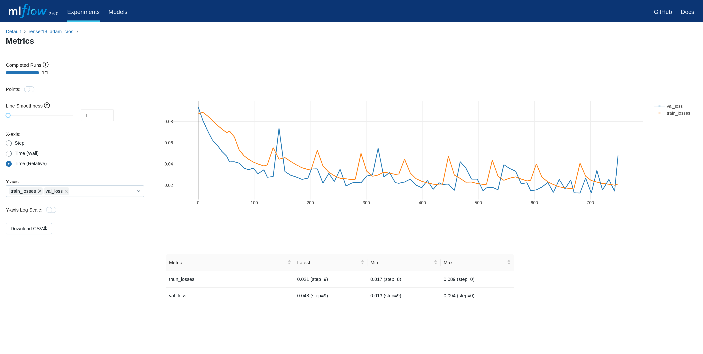

# ML Flow

### What

MLflow stands out as a robust and versatile solution in the realm of experiment management and model lifecycle tools. As
an open-source platform, MLflow distinguishes itself with transparency and extensive customization capabilities,
offering a framework that accommodates diverse machine-learning workflows. Its language-agnostic and framework-agnostic
design ensures flexibility and seamless integration with popular frameworks, making it a versatile choice for various ML
projects.

### Why

MLflow's appeal is heightened by its automatic logging functionality, setting it apart in terms of efficiency. Unlike
commercial platforms like Comet and Weights & Biases, MLflow automates the logging of metrics, parameters, and models
without explicit log statements. This streamlined logging process facilitates easy integration into existing codebases,
requiring minimal lines of code to initiate tracking. The platform's thriving community and widespread industry adoption
contribute to its resilience and continuous improvement. MLflow enables collaborative efforts among data scientists,
allowing them to share a single dashboard, view, and compare results from various experiments. Beyond experiment
tracking, MLflow offers a holistic approach to machine learning lifecycle management, providing tools for storing,
versioning, packaging code into reproducible runs, and deploying models. This comprehensive suite positions MLflow as a
one-stop solution for the end-to-end ML lifecycle. However, it's essential to note that considerations such as the need
for server maintenance, potential challenges for smaller entities, and security configurations for sensitive data
handling may impact its adoption, and collaborative features, while present, might not match the extensive offerings of
commercial alternatives.

### How

n music genre classification, MLflow plays a pivotal role in monitoring and managing the training process. Its unified
interface allows for the systematic comparison of algorithms and hyperparameters, crucial in complex pipelines involving
feature extraction, model training, and evaluation. Seamlessly integrated into the pipelines, MLflow monitors key
metrics, with a focus on losses, ensuring comprehensive documentation for transparency and reproducibility. Beyond
tracking, MLflow facilitates precise model versioning, aiding in the selection of optimal configurations. In the broader
context of model lifecycle management, MLflow's centralized repository streamlines retrieval, deployment, and sharing
across different environments. Scientifically grounded and versatile, MLflow meets the demands of ML experimentation in
music genre classification, providing transparency and optimization insights. Illustrative figures highlight its utility
in experiment tracking and metrics visualization within this thesis implementation.

Use case:

~~~python
import mlflow

with mlflow.start_run(device, train_loss, val_loss, epoch):
    mlflow.log_param('device', device)

    mlflow.log_metric('train_losses', train_loss, step=epoch)
    mlflow.log_metric('val_loss', val_loss, step=epoch)
~~~

### ML flow experimental page

### ML flow metric page

